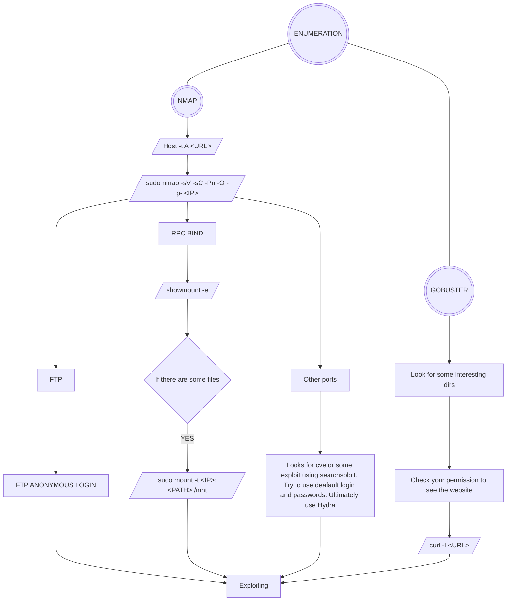

### Web-Penetration-Testing-Algorithm
# Algorithm showing the order in which information is mined for web pages

---

## Tools we are using here
- NMAP
- GoBuster
- Responder
- Hydra

---

## General (enumeration)

---

##TO DO

-[ ] Checking what's webiste engine is running on
-[ ] XSS,CSRF,SQLi etc.
-[ ] Priviledge Escalation
